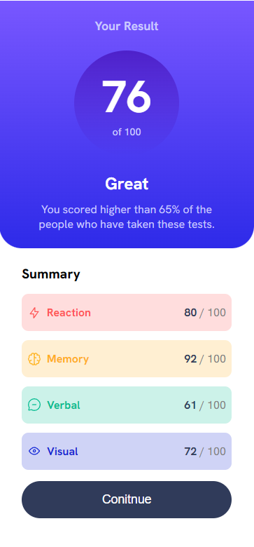

# Frontend Mentor - Results summary component

# Project Name
- This challenge has something for everyone. It’s a HTML and CSS only project, but we’ve also provided a JSON file of the test results for anyone wanting to practice JS.
- Live demo [Results summary component](https://www.frontendmentor.io/challenges/results-summary-component-CE_K6s0maV). 

## Table of Contents
* [General Info](#general-information)
* [Technologies Used](#technologies-used)
* [Features](#features)
* [Screenshots](#screenshots)
* [Acknowledgements](#acknowledgements)
* [Contact](#contact)

## General Information
- This is my second solution of Frontend Mentor. An excellent exercise in combining HTML, CSS and its add-ons like Flexbox. Not forgetting about responsiveness.

## Technologies Used
- HTML5 Markup
- CSS 
- Flexbox
- Grid
- RWD - Responsive Web Design 

## Features
List the ready features here:
- Linear gradient background color
- Connection Flexbox with Grid
- The :nth-child() CSS pseudo-class

## Screenshots

## Acknowledgements
- This project was based on [Frontend Mentor](https://www.example.com).

## Contact
Created by [@mr_cyclist] - contact me!
